# AnsSheet

## 介绍
答题卡识别程序 

## 软件架构
MATLAB

## 需求分析

1. 识别答题卡答案选项
2. 与正确答案对照
3. 判别并计算分数
4. 将结果写入Excel文件
5. 接近100%识别率

## 技术要求
1. 预处理——灰度化，二值化等
2. 倾斜校正——hough变换
3. 畸变校正——角点检测，投影变换
4. 较低误识别率，准确定位填涂痕迹
5. 目标检测结果与标准答案进行对比，给出分析结果

## 过程演示图
#### 1. 灰度化

#### 2. 预处理
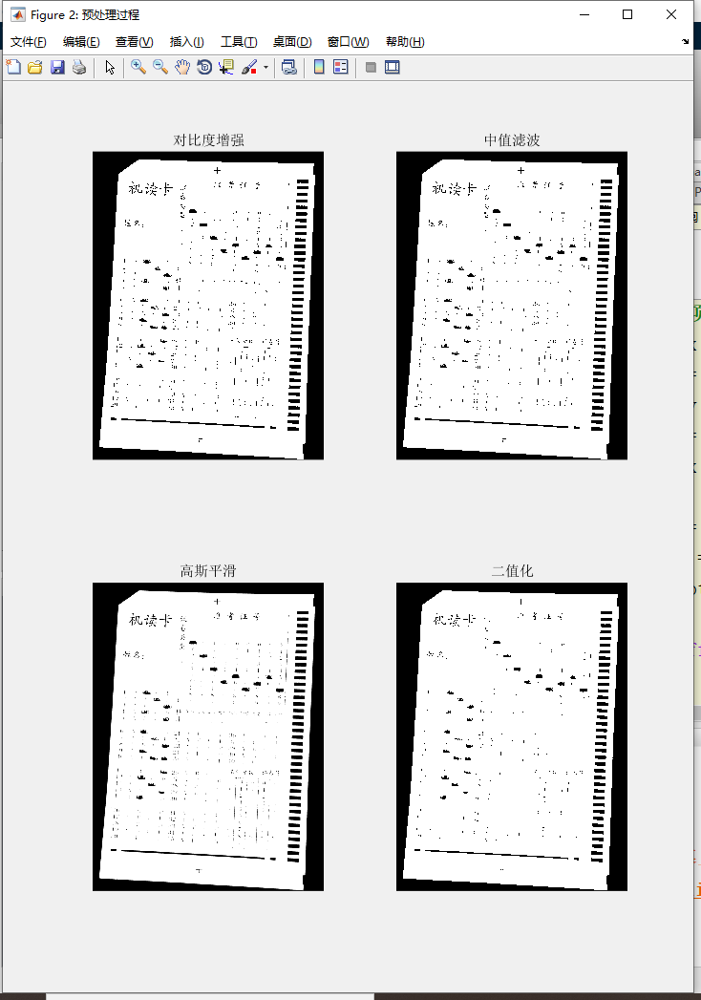
#### 3 .边缘检测
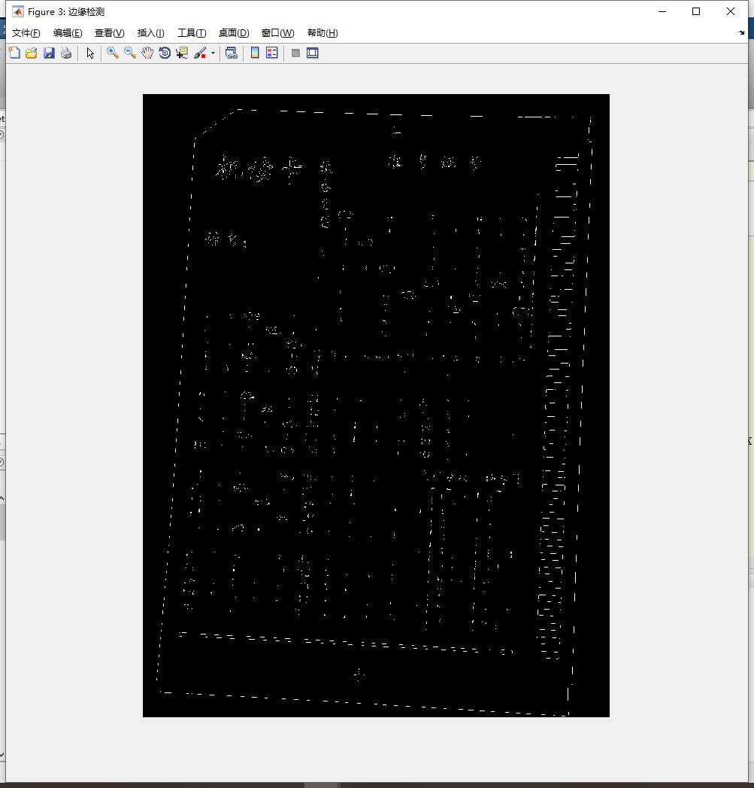
#### 4. 定位感兴趣区域轮廓
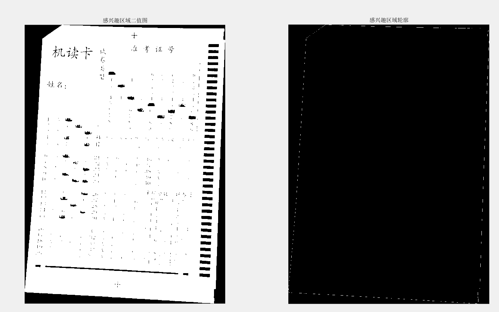
#### 5. 倾斜校正
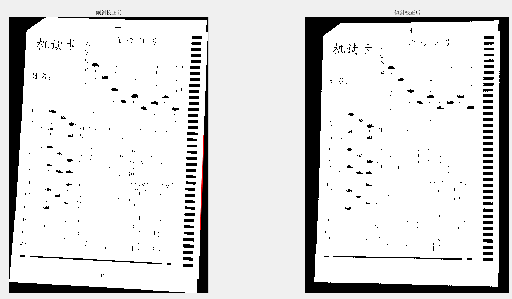
#### 6. 再次精确定位感兴趣区域
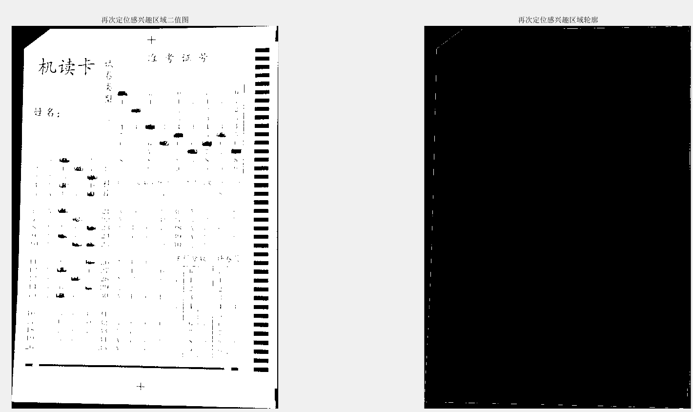
#### 7. 闭运算
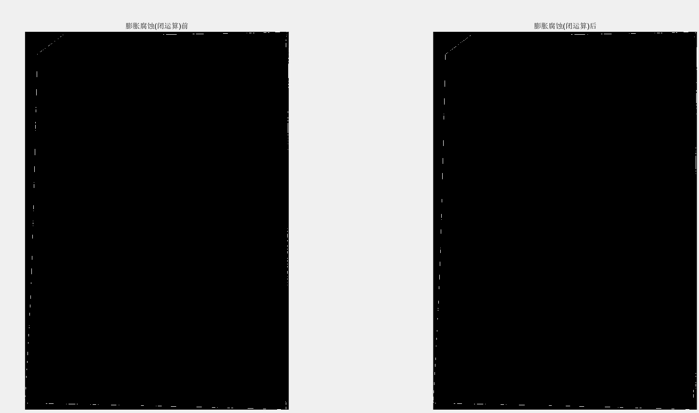
#### 8. 角点检测
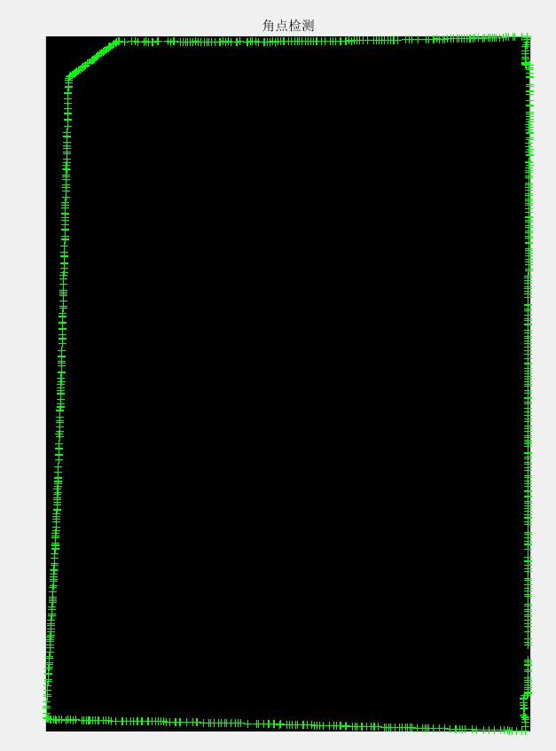
#### 9. 精确定位4个角点（其中左上角的两个只需要一个就好）
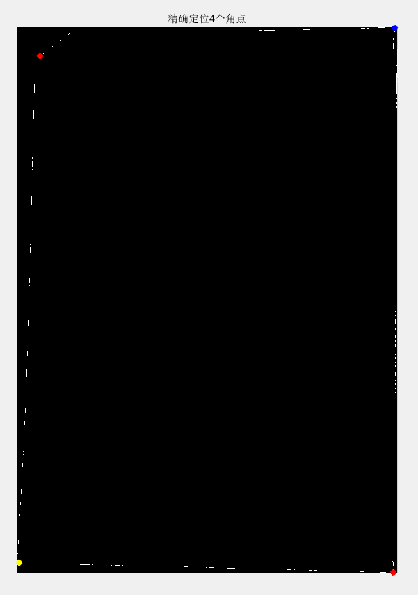
#### 10. 畸变校正（投影变换）
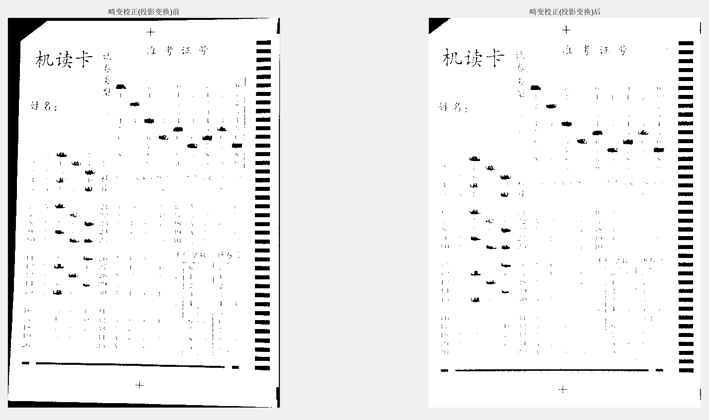
#### 11. 划分填涂区域
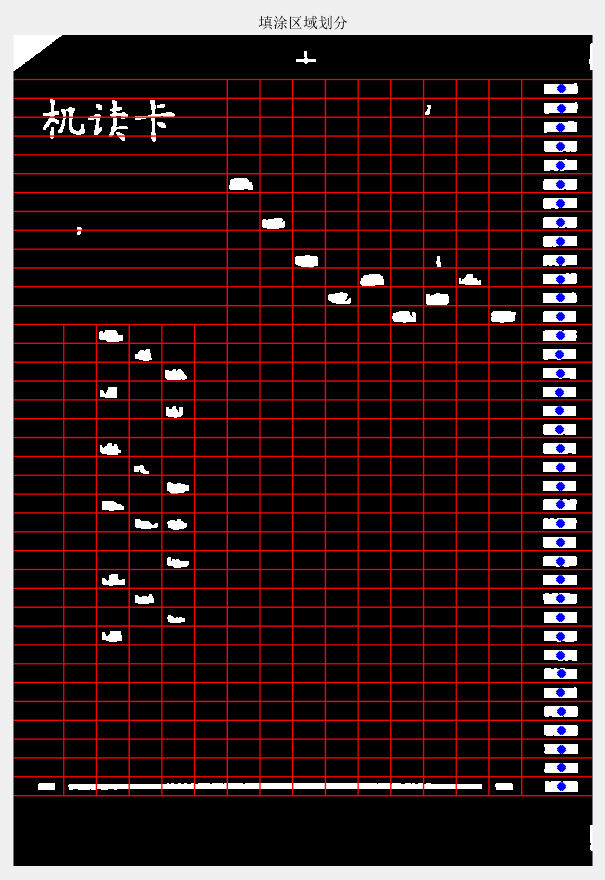
#### 12. 识别结果输出到Excel文件
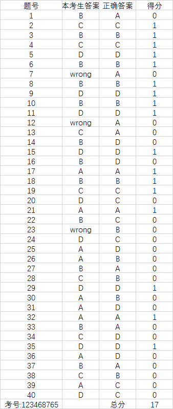

